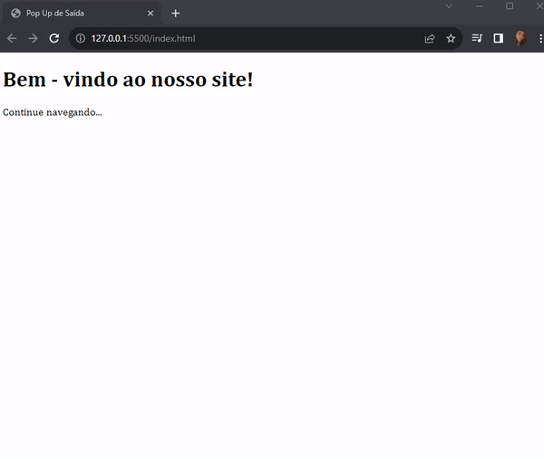

# Pop Up de Saída

Projeto desenvolvido em HTML,CSS e Java Script. O site desenvolvido mostra a funcionalidade de um Pop Up de Saída. Ao aproximar o mouse da parte superior indicando uma possível saída do site, um Pop Up é acionado antes do fechamento do site.

🔗 [Click here to access](https://n4ju15.github.io/pop_up_saida/)

## Tecnologias

- HTML
- CSS
- JavaScript
- Git and Github

